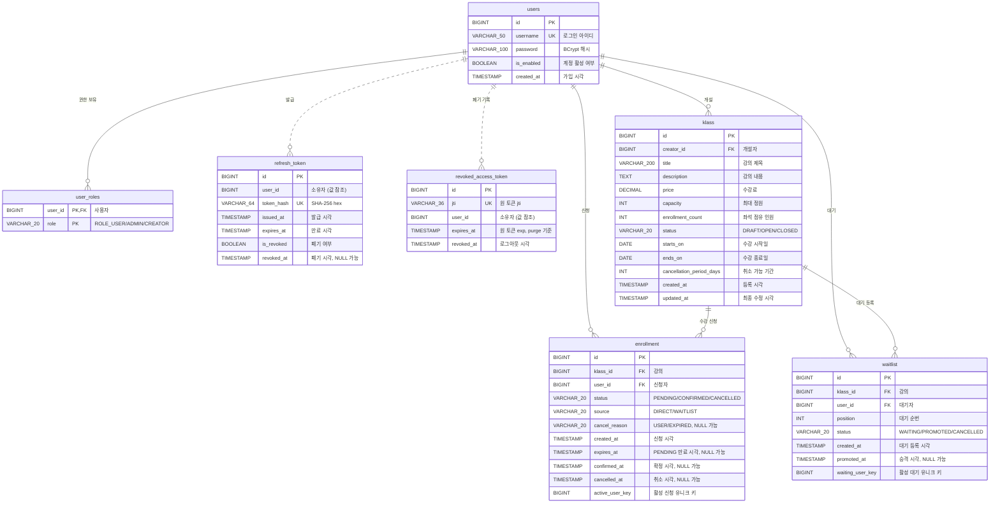

# klass

강의 개설자와 수강생을 위한 **강의 수강신청 백엔드 API 서버**

---

## 프로젝트 개요

강의 개설자가 강의를 등록하고 모집 상태를 관리하며, 수강생이 강의를 신청·결제확정·취소하고
정원이 찬 강의는 대기열로 기다릴 수 있는 **강의 수강신청 API 서버**다. 신청 주체를 신뢰하기
위한 JWT 인증을 함께 구현했다.

핵심 요구사항은 CRUD 가 아니라 **정원 보장**이다. "마지막 한 자리"에 신청이 동시에 몰려도
정원이 초과되지 않아야 하므로, 그 불변식을 애플리케이션 로직이 아니라 **데이터 모델과
DB 제약이 지탱하도록** 설계했다.

| 구분 | 내용 |
|------|------|
| **성격** | 신규 구축. 수강신청 도메인은 새로 설계했고, 인증은 **선행 프로젝트에서 직접 구축한 JWT 모듈**([sample-jwt-authentication](https://github.com/Chals85/sample-jwt-authentication))을 재사용해 확장했다 |
| **역할** | 요구사항 해석 · 데이터 모델 설계 · 구현 · 테스트 · API 문서화 전 범위 |
| **규모** | API 19개(16 경로) · 테이블 7개 · 테스트 477건 |

---

## 기술 스택

| 구분 | 사용 기술 |
|------|-----------|
| **Language** | Java 25 |
| **Framework** | Spring Boot 4.1.1 · Spring MVC · Spring Data JPA · Spring Security · Jakarta Validation |
| **Build** | Gradle 9.7.1 · Gradle Toolchain |
| **Database** | H2 In-Memory (`MODE=MySQL`) |
| **Persistence** | JPA / Hibernate · QueryDSL 5 |
| **Authentication** | Spring Security · OAuth2 Resource Server · Nimbus JOSE JWT |
| **API Documentation** | Spring REST Docs · restdocs-api-spec · OpenAPI 3 · ReDoc · Swagger UI |
| **Test** | JUnit 5 · Spring Boot Test |
| **Etc.** | Lombok |

---

## 실행 방법

### 서버 실행

```bash
git clone <repository-url>
cd klass
./gradlew bootRun
```

애플리케이션은 기본적으로 아래 주소에서 실행된다.

```text
http://localhost:8080
```

> `bootRun` 실행 시 테스트와 API 문서 생성도 함께 수행된다.
> 테스트가 실패하면 애플리케이션도 기동되지 않는다. 이는 REST Docs 기반 API 문서를 실제
> 테스트 결과와 일치시키기 위해 의도적으로 구성한 빌드 정책이다.

---

### 테스트 계정

애플리케이션 실행 시 아래 계정이 기본 데이터로 생성된다.

| username | password | 권한 | 용도 |
|----------|----------|------|------|
| `chals` | `test` | `ROLE_USER` | 일반 수강생 |
| `chals2` | `test` | `ROLE_USER` | 동시성·중복 신청 시나리오 검증용 |
| `creator` | `test` | `ROLE_USER`, `ROLE_CREATOR` | 강의 개설자 |

---

### API 문서

| 경로 | 용도 |
|------|------|
| `/docs/api-guide.html` | **ReDoc** — REST Docs 테스트 결과를 기반으로 생성된 API 명세 |
| `/docs/api-test.html` | **Swagger UI** — API를 브라우저에서 직접 호출·테스트 |
| `/docs/openapi3.json` | 생성된 OpenAPI 3 Specification |
| `/swagger-ui.html` | springdoc 기반 런타임 API 문서 |

API 명세 확인은 `/docs/api-guide.html`, 직접 호출 테스트는 `/docs/api-test.html` 사용을
권장한다.

---

### H2 Console

개발 및 데이터 확인을 위해 H2 Console을 제공한다.

| 항목 | 값 |
|------|-----|
| URL | `/h2-console` |
| JDBC URL | `jdbc:h2:mem:klass` |
| User Name | `sa` |
| Password | 없음 |

> H2는 인메모리 DB이므로 애플리케이션을 재기동하면 데이터가 초기화된다.

---

### 빌드와 문서 생성

API 문서는 테스트 결과를 기준으로 생성되며 문서 생성 과정을 빌드 파이프라인에 포함했다.

```text
Test
  ↓
REST Docs Snippet
  ↓
OpenAPI Specification
  ↓
ReDoc / Swagger UI
  ↓
bootRun / bootJar
```

따라서 테스트와 실제 API 동작, 제공되는 API 문서가 서로 어긋나는 것을 최소화하도록 구성했다.

자세한 설계 의도는 「설계 결정과 이유 → API 문서를 빌드에 포함한 이유」에서 설명한다.

---

## API 목록 및 예시

상세 API 명세와 요청/응답 Schema는 Swagger 및 ReDoc으로 제공한다.

- **Swagger UI** (`/docs/api-test.html`) — API 호출 및 테스트
- **ReDoc** (`/docs/api-guide.html`) — 전체 API 명세 조회
- **OpenAPI 3 스펙** (`/docs/openapi3.json`) — 원본 스펙

### 공통 규칙

인증이 필요한 API는 Access Token을 Bearer 방식으로 전달한다.

```http
Authorization: Bearer {accessToken}
```

응답은 공통 Envelope 구조를 사용한다.
단, 로그아웃 API는 `204 No Content` 를 반환한다.

```jsonc
// 성공
{
  "success": true,
  "data": { /* ... */ },
  "error": null
}

// 실패
{
  "success": false,
  "data": null,
  "error": {
    "code": "KLASS_CAPACITY_FULL",
    "message": "정원이 모두 찼습니다",
    "details": {}
  }
}
```


### API 목록

| Method | Path | 설명 | 인증/권한 |
|--------|------|------|-----------|
| `POST` | `/v1/auth/login` | 로그인 및 토큰 발급 | 없음 |
| `POST` | `/v1/auth/reissue` | Refresh Token 회전 | 없음 |
| `POST` | `/v1/auth/logout` | Refresh Token 폐기 및 Access Token 블랙리스트 등록 | 인증 |
| `GET` | `/v1/users/me` | 내 정보 조회 | 인증 |
| `POST` | `/v1/klasses` | 강의 등록 | `ROLE_CREATOR` |
| `GET` | `/v1/klasses` | 공개 강의 목록 | 선택적 인증 |
| `PUT` | `/v1/klasses/{id}` | 강의 정보 전체 수정 | `ROLE_CREATOR` + 소유권 |
| `GET` | `/v1/klasses/{id}` | 강의 상세 조회 | 선택적 인증 |
| `PATCH` | `/v1/klasses/{id}/status` | 강의 상태 변경 | `ROLE_CREATOR` + 소유권 |
| `GET` | `/v1/klasses/me` | 내가 개설한 강의 목록 | `ROLE_CREATOR` |
| `POST` | `/v1/klasses/{klassId}/enrollments` | 수강 신청 | 인증 |
| `GET` | `/v1/klasses/{klassId}/enrollments` | 강의별 수강생 목록 | `ROLE_CREATOR` + 소유권 |
| `GET` | `/v1/enrollments/me` | 내 신청 목록 | 인증 |
| `GET` | `/v1/enrollments/{id}` | 신청 상세 조회 | 본인 |
| `POST` | `/v1/enrollments/{id}/confirm` | 수강 확정 | 본인 |
| `POST` | `/v1/enrollments/{id}/cancel` | 수강 취소 | 본인 |
| `POST` | `/v1/klasses/{klassId}/waitlists` | 대기열 등록 | 인증 |
| `GET` | `/v1/waitlists/me` | 내 대기열 목록 | 인증 |
| `POST` | `/v1/waitlists/{id}/cancel` | 대기 취소 | 본인 |


### 주요 API 동작

#### 강의 상태

강의는 생성 시 항상 `DRAFT` 상태로 시작하며 다음 방향으로만 변경된다.

```text
DRAFT → OPEN → CLOSED
   └──────────→ CLOSED
```

`OPEN → DRAFT`, `CLOSED → OPEN` 과 같은 역전이는 허용하지 않는다.

#### 수강 신청

수강 신청이 성공하면 바로 확정하지 않고 `PENDING` 상태로 좌석을 점유한다.

```text
수강 신청
    ↓
 PENDING
  ├─ 결제 확정 → CONFIRMED
  └─ 취소/만료 → CANCELLED
```

`PENDING` 도 좌석 점유 인원에 포함되며, 제한 시간 안에 확정되지 않으면 만료 처리 후 좌석을
반환한다.

#### 정원 초과와 대기열

정원이 가득 찬 상태에서 수강 신청을 시도하면 `409 Conflict` 를 반환한다.

```text
KLASS_CAPACITY_FULL
```

사용자를 자동으로 대기열에 넣지 않으며, 사용자가 별도의 대기열 등록 API를 호출하도록 했다.

좌석이 반환되면 대기열 최우선 사용자를 승격하고 `WAITLIST` 출처의 `PENDING` 신청을 생성한다.

```text
WAITING
   ↓
PROMOTED
   ↓
Enrollment(PENDING, source=WAITLIST)
```


### 선택적 인증

강의 목록 및 상세 조회는 비로그인 사용자도 이용할 수 있다.

유효한 Access Token이 전달된 경우에는 사용자 정보를 이용해 조회 범위를 확장하며, 개설자는
자신의 `DRAFT` 강의도 조회할 수 있다.


### 페이지네이션

목록 조회 API는 `OFFSET` 방식 대신 커서 기반 페이지네이션을 사용한다.

| 파라미터 | 설명 |
|----------|------|
| `cursor` | 이전 응답의 `nextCursor`. 첫 페이지에서는 생략 |
| `size` | 페이지 크기. 기본 `20`, 최대 `100` |
| `status` | 상태 필터. 지원하는 API에서만 사용 |

응답에는 다음 페이지 존재 여부와 다음 커서가 포함된다.

```json
{
  "items": [],
  "hasNext": true,
  "nextCursor": 41
}
```

상세 Request/Response Schema, HTTP Status Code 및 Error Code는
**Swagger / ReDoc 문서에서 확인할 수 있다.**

---

## 데이터 모델

서비스의 핵심 데이터는 **사용자, 강의, 수강신청, 대기열**을 중심으로 구성했으며, 인증을
위한 토큰 테이블을 별도로 두었다.



### 테이블 구성

| 테이블 | 역할 |
|--------|------|
| `users` | 사용자 계정 |
| `user_roles` | 사용자 다중 권한 |
| `klass` | 강의 및 정원 관리 |
| `enrollment` | 수강 신청 및 좌석 점유 상태 관리 |
| `waitlist` | 강의별 대기 순서 및 승격 상태 관리 |
| `refresh_token` | Refresh Token 발급 및 회전 관리 |
| `revoked_access_token` | 로그아웃된 Access Token의 `jti` 관리 |

상태값은 모두 `@Enumerated(EnumType.STRING)` 으로 저장한다. Enum 순서 변경이 기존 데이터의
의미에 영향을 주지 않도록 ordinal 방식은 사용하지 않았다.

| ENUM | 값 |
|------|-----|
| `Role` | `ROLE_USER`, `ROLE_ADMIN`, `ROLE_CREATOR` |
| `KlassStatus` | `DRAFT`, `OPEN`, `CLOSED` |
| `EnrollmentStatus` | `PENDING`, `CONFIRMED`, `CANCELLED` |
| `EnrollmentSource` | `DIRECT`, `WAITLIST` |
| `CancelReason` | `USER`, `EXPIRED` |
| `WaitlistStatus` | `WAITING`, `PROMOTED`, `CANCELLED` |


### 상태 전이

#### 강의

```text
DRAFT ──▶ OPEN ──▶ CLOSED
   └──────────────▶ CLOSED
```

강의 상태는 단방향으로만 변경한다.

- `DRAFT → OPEN`: 모집 시작
- `OPEN → CLOSED`: 모집 종료
- `DRAFT → CLOSED`: 개설 전 종료
- `OPEN → DRAFT`: 금지
- `CLOSED → OPEN/DRAFT`: 금지

모집을 시작한 이후에는 신청자가 존재할 수 있으므로 다시 초안 상태로 되돌리지 않는다.
현재 범위에서는 종료된 강의의 재모집도 지원하지 않는다.

#### 수강신청

```text
PENDING ──▶ CONFIRMED
    │
    └─────▶ CANCELLED

CONFIRMED ──▶ CANCELLED
```

- `PENDING → CONFIRMED`: 유효시간 내 수강 확정
- `PENDING → CANCELLED`: 사용자 취소 또는 만료
- `CONFIRMED → CANCELLED`: 취소 가능 기간 내 사용자 취소
- `CANCELLED`: 종착 상태

취소 이후 다시 신청하는 경우 기존 행의 상태를 되돌리지 않고 **새로운 신청 행을 생성**한다.

#### 대기열

```text
WAITING ──▶ PROMOTED
    │
    └─────▶ CANCELLED
```

- `WAITING → PROMOTED`: 좌석 발생 시 대기자 승격
- `WAITING → CANCELLED`: 대기 취소
- 승격 이후의 상태는 새롭게 생성된 `enrollment` 에서 관리한다.


### 주요 설계 결정

#### 1. 좌석 점유 상태를 `enrollment` 로 일원화

좌석을 점유하는 상태는 `enrollment` 의 `PENDING`, `CONFIRMED` 두 상태로 한정했다.

`waitlist` 는 순서만 관리하며 좌석을 점유하지 않는다.

따라서 좌석 수 계산 기준이 다음과 같이 명확해진다.

```text
점유 좌석 = PENDING + CONFIRMED
```

승격 시에도 `waitlist` 자체가 좌석을 점유하는 것이 아니라 `enrollment(PENDING)` 을
생성하면서 좌석을 확보한다.

#### 2. `enrollment_count` 비정규화

강의 목록과 상세 조회에서 매번 `enrollment` 를 `COUNT(*)` 하지 않도록
`klass.enrollment_count` 에 현재 점유 좌석 수를 관리한다.

조회 비용을 줄이는 대신 카운터와 실제 신청 데이터가 달라질 수 있으므로 다음 방식으로
정합성을 보완했다.

- 신청 상태 변경과 카운터 변경을 **동일 트랜잭션**에서 처리
- `CHECK (enrollment_count BETWEEN 0 AND capacity)` 로 DB 수준의 범위 보장
- 정합성 검증 및 복구(reconcile) 절차 별도 정의

즉, 조회 성능을 위해 비정규화를 선택하되 **정합성 검증 수단을 함께 두는 방식**을 선택했다.

#### 3. 활성 신청 중복을 DB에서도 방지

하나의 사용자가 동일 강의에 동시에 여러 개의 활성 신청을 가질 수 없도록 해야 한다.

단순히 `(klass_id, user_id)` 에 UNIQUE를 적용하면 취소 후 재신청이 불가능하므로 생성
컬럼을 이용했다.

```sql
active_user_key BIGINT GENERATED ALWAYS AS (
    CASE
        WHEN status <> 'CANCELLED' THEN user_id
    END
)

UNIQUE (klass_id, active_user_key)
```

활성 신청에서는 `active_user_key = user_id` 가 되므로 중복이 제한된다.

반면 `CANCELLED` 상태에서는 `NULL` 이 되고 UNIQUE 제약에서 서로 충돌하지 않기 때문에
취소 이력을 유지하면서 재신청할 수 있다.

`waitlist.waiting_user_key` 도 동일한 방식으로 활성 대기 중복을 제한한다.


### 날짜와 시각 타입

도메인의 의미에 따라 날짜와 시각을 구분했다.

| 접미사 | 타입 | 컬럼 |
|--------|------|------|
| `_on` | `LocalDate` | `starts_on` · `ends_on` |
| `_at` | `LocalDateTime` | `created_at` · `expires_at` · `confirmed_at` · `cancelled_at` |
| `_days` | 기간 값 | `cancellation_period_days` |

강의 시작일과 종료일은 '몇 일부터 몇 일까지'라는 날짜 자체가 중요하므로 시간 정보를 갖지
않는 `LocalDate` 를 사용한다.

반면 토큰 만료, `PENDING` 만료와 같이 정확한 시점 판정이 필요한 값은 시각 타입으로 관리한다.

애플리케이션에서 현재 시각을 직접 호출하지 않고 **주입된 `Clock` 을 통해 생성**하도록 하여
시간 기준을 한 곳에서 관리하고 테스트에서 원하는 시각을 고정할 수 있도록 했다.

---

## 요구사항 해석 및 가정

과제에서 명시되지 않은 세부 정책은 서비스 흐름의 일관성과 구현 범위를 고려하여 다음과 같이
해석하였다.

### 1. 사용자와 권한

사용자는 하나의 역할만 가지는 것이 아니라 여러 역할을 동시에 가질 수 있다고 가정한다.

- `ROLE_USER`: 강의 수강 신청 및 대기열 이용
- `ROLE_CREATOR`: 강의 개설 및 관리
- `ROLE_ADMIN`: 관리자 권한

따라서 크리에이터도 `ROLE_USER` 권한을 함께 가질 수 있으며, 본인이 개설하지 않은 다른
강의에는 일반 수강생과 동일하게 수강 신청할 수 있다.

### 2. 강의 생성 및 상태 관리

강의를 개설하기 위해서는 `ROLE_CREATOR` 권한이 필요하다.

신규 강의의 최초 상태는 요구사항에 따라 항상 `DRAFT` 로 생성한다.

강의 상태는 다음과 같이 **단방향으로만 전이**한다.

```text
DRAFT → OPEN → CLOSED
   └──────────→ CLOSED
```

- `DRAFT`: 강의 준비 단계
- `OPEN`: 모집 중
- `CLOSED`: 모집 종료
- `OPEN → DRAFT`, `CLOSED → OPEN` 등의 역전이는 허용하지 않는다.

본 과제에서는 상태 전이를 단순하게 유지하기 위해 모집 종료 후 재오픈과 같은 역전이
시나리오는 구현 범위에서 제외한다.

상태 변경은 일반 강의 수정과 분리하여 별도의 상태 변경 API를 통해 처리한다.

### 3. 강의 수정 정책

강의 상태에 따라 수정 가능한 범위를 다르게 적용한다.

- `DRAFT`: 제목, 설명, 가격, 정원, 수강 기간 등 전체 정보 수정 가능
- `OPEN`: 모집이 시작된 이후이므로 수강 조건에 영향을 줄 수 있는 가격, 정원, 기간 등의
  변경을 제한하고 제목만 수정 가능
- `CLOSED`: 모집 종료 상태이므로 제목 외 주요 정보 수정 불가

모집 이후 가격이나 정원 등의 변경이 기존 신청자에게 영향을 줄 수 있으므로 보수적인 정책을
적용하였다.


### 4. 강의 조회

강의 목록과 상세 정보는 로그인 여부와 관계없이 조회할 수 있도록 한다.

다만 공개 조회에서는 모집 가능한 강의를 중심으로 노출하고, 크리에이터에게는 본인이 생성한
`DRAFT` 강의를 포함하여 관리할 수 있도록 **내 강의 목록 조회 기능을 별도로 제공한다.**

강의 상세에서는 현재 좌석을 점유하고 있는 신청 인원을 함께 제공한다.


### 5. 수강 신청과 좌석 점유

수강 신청은 `OPEN` 상태의 강의에서만 가능하다.

신청이 성공하면 즉시 수강 확정되는 것이 아니라 `PENDING` 상태가 되며, 이 시점부터 좌석을
점유한다고 해석한다.

```text
수강 신청
   ↓
PENDING
   ├─ 결제 완료 → CONFIRMED
   └─ 취소/만료 → CANCELLED
```

따라서 정원 계산에는 `PENDING` 과 `CONFIRMED` 상태를 모두 포함한다.

동시에 여러 사용자가 마지막 좌석에 신청하는 경우에도 최대 정원을 초과하지 않도록 동시성을
제어하며, 좌석 확보에 실패한 신청은 거부한다.

정원이 가득 찼다고 해서 사용자를 자동으로 대기열에 등록하지 않는다.
수강 신청과 대기 신청은 별개의 사용자 의사로 보고 사용자가 명시적으로 대기열 등록을
요청하도록 한다.


### 6. 결제 확정

외부 결제 시스템은 과제 범위에 포함되지 않으므로 실제 PG 연동은 구현하지 않는다.

결제가 정상적으로 완료되었다는 상황을 **결제 확정 API 호출로 대체**하며, 유효한 `PENDING`
신청에 대해서만 다음 상태 전이를 허용한다.

```text
PENDING → CONFIRMED
```

`PENDING` 에는 유효시간을 두며 해당 시간 안에 결제가 확정되지 않으면 만료 처리하여 좌석을
반환한다.

직접 신청의 `PENDING` 유효시간과 대기열 승격 후 부여되는 `PENDING` 유효시간은 서로 다른
정책을 적용할 수 있다고 가정한다.


### 7. 수강 취소

`PENDING` 상태의 신청은 결제 전 취소할 수 있다.

`CONFIRMED` 상태에서는 결제 확정 시점을 기준으로 정해진 취소 가능 기간 내에서만 취소할 수
있다.

```text
PENDING   → CANCELLED
CONFIRMED → CANCELLED
```

취소가 완료되면 해당 신청이 사용하던 좌석을 즉시 반환한다.

반환된 좌석이 있고 강의가 `OPEN` 상태이며 대기자가 존재하는 경우에는 대기 순번이 가장 빠른
사용자를 승격한다.

`CLOSED` 상태에서는 새로운 수강 신청을 받지 않으므로 좌석이 반환되더라도 대기자를 승격하지
않는다.


### 8. 대기열

정원이 가득 찬 `OPEN` 강의에 대해서만 사용자가 명시적으로 대기열에 등록할 수 있다.

대기열은 등록 순서를 기준으로 순번을 관리한다.

```text
WAITING → PROMOTED
    └───→ CANCELLED
```

다음 상황에서 좌석이 반환되면 가장 앞선 `WAITING` 사용자를 승격한다.

- `PENDING` 신청 취소
- `PENDING` 결제 유효시간 만료
- 취소 가능 기간 내 `CONFIRMED` 신청 취소

승격된 사용자는 즉시 `CONFIRMED` 처리하지 않고 새로운 `PENDING` 신청을 부여한다.
따라서 승격된 사용자 역시 일정 시간 내에 결제를 확정해야 최종 수강생이 된다.

대기 중인 사용자는 언제든 대기를 취소할 수 있다. 대기 취소는 좌석을 생성하지 않으므로
**다음 사용자를 즉시 승격시키지는 않는다.**


### 9. 강의 마감과 대기열

강의가 `CLOSED` 상태로 변경되면 더 이상 신규 신청 및 대기 등록을 허용하지 않는다.

또한 모집 종료 이후 대기자를 승격할 이유가 없으므로 남아 있는 `WAITING` 상태의 대기 신청은
`CANCELLED` 로 처리한다.

기존 `CONFIRMED` 신청은 강의 마감과 관계없이 유지하며, 취소 가능 기간 정책에 따라 취소할
수 있다.


### 10. 사용자 조회 기능

수강생은 다음 정보를 조회할 수 있도록 한다.

- 자신의 수강 신청 목록
- 개별 수강 신청 상태
- 자신이 등록한 대기열 및 현재 상태

크리에이터는 자신이 개설한 강의에 대해 신청자 목록을 조회할 수 있다.

다른 크리에이터가 개설한 강의의 신청자 목록은 조회할 수 없도록 소유권을 검증한다.


### 11. 배치 처리와 알림

`PENDING` 상태의 결제 유효시간 만료는 사용자의 API 호출에 의존하지 않고 배치 작업을 통해
처리한다고 가정한다.

배치는 만료된 신청을 `CANCELLED` 처리하고 좌석을 반환하며, 조건을 만족하는 경우 다음
대기자를 승격한다.

대기열 승격 알림을 위한 Push, SMS, 이메일 등의 채널은 과제 요구사항에 정의되어 있지 않으므로
구현 범위에서 제외한다.

다만 실제 서비스에서는 승격 사실을 사용자가 인지해야 결제를 진행할 수 있으므로, **본
과제에서는 승격 시 사용자에게 정상적으로 알림이 전달된다는 전제**로 대기열 흐름을 설계한다.

---

## 설계 결정과 이유

### 1. 헥사고날 아키텍처를 도입한 이유

강의 상태 전이, 수강 신청, 정원 제한, 대기열 처리와 같은 핵심 규칙이 웹 프레임워크나
데이터베이스 구현에 직접 의존하지 않도록 헥사고날 아키텍처를 도입하였다.

애플리케이션의 유스케이스를 중심에 두고, 웹 요청과 데이터베이스 접근은 Port와 Adapter를
통해 외부로 분리하였다. 이를 통해 외부 기술이 변경되어도 핵심 비즈니스 로직에 미치는
영향을 줄이고, 데이터베이스 없이도 주요 정책을 테스트할 수 있도록 하였다.

추상화 계층과 변환 코드가 늘어나는 비용은 있지만, 상태 전이와 동시성 규칙이 중요한
서비스이므로 테스트 용이성과 변경 대응력을 우선하였다.

---

### 2. OPEN 상태에서 DRAFT 상태로 역전하지 않도록 한 이유

강의는 다음과 같은 단방향 생명주기를 가진다.

```text
DRAFT → OPEN → CLOSED
```

`DRAFT` 는 공개 전 작성 상태이고, `OPEN` 은 외부에 공개되어 신청을 받을 수 있는 상태다.
한 번 공개된 강의는 신청자 존재 여부와 관계없이 다시 작성 상태로 되돌리지 않는다.

신청자가 없을 때만 역전이를 허용하는 방법도 고려할 수 있지만, 대기자나 좌석 점유 상태 등
추가 조건이 생길수록 역전 가능 여부를 판단하는 규칙이 복잡해진다. 따라서 예외 조건을
추가하지 않고 상태 전이를 단방향으로 제한하였다.

`OPEN` 이후에는 3번의 정책에 따라 타이틀만 수정할 수 있다. 다른 운영 조건을 변경해야
한다면 기존 강의를 마감하고 새로운 강의를 생성한다.

---

### 3. OPEN 상태에서 타이틀만 수정할 수 있도록 한 이유

`OPEN` 상태는 강의의 운영 조건이 확정되어 신청을 받고 있는 상태다. 따라서 정원과 같이
신청 결과에 영향을 주는 정보는 변경하지 않는다.

타이틀은 좌석 수나 신청 상태에 영향을 주지 않는 설명 정보이므로, 오탈자나 표현을 정정할
수 있도록 `OPEN` 상태에서도 변경을 허용하였다.

정책에 따라 `OPEN` 상태에서 수정 요청이 들어오면 타이틀만 반영하고, 타이틀 이외의
변경값은 오류로 처리하지 않고 무시한다. 이를 통해 공개된 강의의 운영 조건은 유지하면서
필요한 문구 수정만 허용하였다.

---

### 4. 좌석 점유에 실패했을 때 자동으로 대기열에 등록하지 않은 이유

수강 신청은 좌석을 즉시 점유하려는 요청이고, 대기열 등록은 향후 좌석이 발생했을 때
승격되기를 원하는 별도의 요청이다.

동시 신청으로 인해 마지막 좌석을 다른 사용자가 먼저 점유했더라도, 사용자의 명시적인 요청
없이 자동으로 대기열에 등록하지 않는다. 자동 등록하면 사용자가 원하지 않은 대기 상태가
만들어질 수 있기 때문이다.

따라서 좌석 점유 실패를 명확하게 반환하고, 대기를 원하는 사용자가 별도의 대기 신청을
수행하도록 설계하였다. 이를 통해 수강 신청과 대기 신청의 사용자 의도를 분리하였다.

---

### 5. 비관적 락으로 동시성을 제어한 이유

수강 신청에서는 다음 규칙이 반드시 보장되어야 한다.

```text
신청된 좌석 수 ≤ 강의 정원
```

동일한 강의에 여러 신청이 동시에 들어오면 여러 요청이 같은 잔여 좌석을 확인할 수 있다.
이를 방지하기 위해 대상 강의 행을 비관적 락으로 조회하고, 좌석 확인과 신청 처리를 하나의
트랜잭션에서 수행하였다.

락은 전체 테이블이 아니라 대상 `klass_id` 에만 적용하므로 서로 다른 강의의 신청은 동시에
처리할 수 있다. 결제 확정이나 대기 포기처럼 좌석 수에 영향을 주지 않는 처리에는 강의 락을
적용하지 않는다.

여러 데이터를 함께 변경할 때는 데드락 가능성을 줄이기 위해 다음 순서로 락을 획득한다.

```text
klass → enrollment → waitlist
```

좌석 반납과 대기자 승격은 하나의 트랜잭션에서 처리하여, 반납된 좌석을 일반 신청자가
대기자보다 먼저 점유하지 못하도록 하였다.

현재 별도의 락 타임아웃은 설정하지 않았으며, 락 보유 시간을 줄이기 위해 트랜잭션 범위를
필요한 처리로 제한하였다.

---

### 6. CLOSED 상태로 마감할 때 남은 대기열을 정리하는 이유

`CLOSED` 상태에서는 대기자 승격이 중단되며, `CLOSED → OPEN` 전이도 허용되지 않는다.
따라서 강의 마감 후 남아 있는 `WAITING` 대기자는 앞으로 영원히 승격될 수 없다.

이를 그대로 두면 승격 가능성이 없는 대기 행이 `WAITING` 상태로 남아 사용자에게 계속
대기 중이라는 거짓 기대를 주게 된다.

따라서 강의를 마감할 때 `cancelRemaining` 을 실행하여 남아 있는 대기 상태를 다음과 같이
변경한다.

```text
WAITING → CANCELLED
```

대기 행을 물리적으로 삭제하는 것은 아니다. 신청 이력은 그대로 보존하고, 더 이상 승격
대상이 아니라는 사실을 `CANCELLED` 상태로 표현한다. 이를 통해 실제 시스템 상태와
사용자에게 표시되는 상태를 일치시켰다.

---

## 테스트 실행 방법

```bash
./gradlew test                 # 단위·통합 테스트 (474건)
./gradlew documentationTest    # 문서 산출물 검증만 (3건)
./gradlew build                # 컴파일 + test + documentationTest — 전체 (477건)

# 특정 테스트만
./gradlew test --tests "*.RefreshTokenTest.rotate*"
./gradlew test --tests "com.toby.klass.integration.*"
```

**현재 상태: 477건 전건 통과, 실패 0 (`BUILD SUCCESSFUL`).**

리포트는 `build/reports/tests/test/index.html` 에 생성된다.

### 테스트 계층 (L1~L5)

| 계층 | 대상 | 위치 |
|:----:|------|------|
| **L1** | 도메인 단위 — 상태 전이, 불변식, 값 객체 | `*/domain/` |
| **L2** | 어댑터 · 서비스 — 저장소 쿼리, 유스케이스 로직 | `*/adapter/out/`, `*/application/service/` |
| **L3** | 컨트롤러 + **REST Docs 스니펫 생성** | `controller/` |
| **L4** | 통합 — 실제 필터 체인·트랜잭션을 통과하는 시나리오 | `integration/*FlowIntegrationTest` |
| **L5** | 문서 산출물이 실제로 서빙되는지 | `integration/DocumentationIntegrationTest` |

**권한 검증은 L4 에만 있다.** L3 는 `@WebMvcTest` + `addFilters = false` 라
`SecurityConfig` 가 배제되고 필터가 꺼진다 — 거기서 401·403 을 단정하면 **검증하는 척만
하는 테스트**가 된다(`ROLE_USER` 로 강의를 등록해도 201 이 나온다). 권한이 실제로 막히는지는
실제 필터 체인을 통과하는 L4 가 확인한다.

**동시성은 L4 에서 실제 스레드로 검증한다.** 잔여 1석에 100건을 동시에 던져 정확히 1건만
성공하는지, 취소 2건이 같은 대기자를 두 번 승격하지 않는지를 본다. 성공 건수만 세지 않고
`enrollment_count` 와 **실제 활성 행 수**를 함께 단정한다 — 카운터만 보면 정합성 붕괴를
놓친다.

**테스트는 문서 생성원이기도 하다.** L3 가 남긴 REST Docs 스니펫이 `openapi3.json` 이 되고,
L5 가 그 산출물이 실제로 서빙되는지 확인한다. 그래서 테스트를 빠뜨리면 문서가 함께 빠진다.

---

## 미구현 / 제약사항

### 알려진 한계 — 대기열 승격 알림

현재 대기자가 승격 사실을 인지할 수 있는 알림 기능은 구현되어 있지 않다.

대기자가 승격되면 10분 동안 유효한 `PENDING` 상태가 생성되지만, 과제 요구사항에
이메일·Push·SMS 등의 알림 채널이 정의되어 있지 않아 해당 기능은 범위에서 제외했다.

따라서 다음과 같은 상황이 발생할 수 있다.

```
대기자 승격 → 승격 미인지 → PENDING 만료 → 다음 대기자 승격 → 반복
```

모든 대기자가 승격 사실을 확인하지 못할 경우 대기열은 소진되지만 좌석이 비어 있는
상태가 발생할 수 있다.

실서비스에서는 알림 채널 도입과 함께 승격 이후 사용자에게 전달하는 방식에 대한 추가
정책이 필요하다.

---

### 과제 범위에서 제외한 기능

요구사항에 포함되지 않았거나 별도의 외부 시스템 및 정책 정의가 필요한 기능은 구현 범위에서
제외했다.

| 항목 | 내용 |
|------|------|
| **외부 결제 연동** | 과제에서는 `/confirm` 을 통한 상태 변경으로 결제를 대체한다. PG 연동, 결제 승인·취소, 환불 및 정산은 범위에 포함하지 않았다. |
| **회원가입 API** | 과제 요구사항에 포함되어 있지 않아 구현하지 않았다. 사용자 데이터는 시딩을 통해 구성하여 수강 관련 기능을 검증했다. |
| **알림 발송 기능** | 이메일·Push·SMS 등 사용할 채널과 전달 정책이 정의되어 있지 않아 구현하지 않았다. |

---

### 도메인 정책으로 제한한 기능

다음 항목은 구현하지 못한 기능이 아니라 현재 요구사항과 도메인 상태 모델을 기준으로
**의도적으로 제한한 동작**이다.

| 항목 | 정책 |
|------|------|
| **`OPEN → DRAFT` 역전이 (D-18)** | 모집이 시작된 이후에는 신청자가 존재할 수 있으므로 다시 초안 상태로 변경할 수 없도록 제한했다. |
| **`CLOSED → OPEN` 재모집** | 모집이 종료된 강의는 다시 모집 상태로 되돌리지 않는다. 재모집이 필요하다면 별도의 정책 정의가 필요하다. |
| **정원 증가 시 대기열 자동 승격 (D-33)** | 현재 `changeCapacity` 는 `DRAFT` 상태에서만 가능하며, `DRAFT` 상태에서는 신청 및 대기자가 존재할 수 없다. 따라서 현재 상태 모델에서는 발생하지 않는 시나리오로 판단했다. |

---

### 운영 환경 전환 시 고려사항

본 과제는 기능 및 설계 검증을 목적으로 개발 환경에 맞춰 구성했다. 실제 운영 환경에 적용할
경우 다음 항목의 변경이 필요하다.

| 항목 | 내용 |
|------|------|
| **`jwt.secret` 관리** | 현재 `application.yml` 에서 관리한다. 운영에서는 환경변수 또는 Secret Manager/Vault 등의 외부 Secret 저장소로 분리해야 한다. |
| **데이터베이스** | H2 인메모리 DB와 `ddl-auto: create-drop` 을 사용하므로 재기동 시 데이터가 초기화된다. 운영 DB 적용과 함께 Flyway/Liquibase 등의 마이그레이션 관리가 필요하다. |
| **생성 컬럼 `STORED`** | H2 호환성으로 `STORED` 옵션을 사용하지 않았다. 운영 DB의 특성에 맞춰 저장형 생성 컬럼 적용 여부를 결정해야 한다. |
| **H2 Console 및 문서 접근** | 개발 편의를 위해 일부 경로를 Security Filter 대상에서 제외했다. 운영에서는 H2 Console을 비활성화하고 API 문서에 별도의 접근 정책을 적용해야 한다. |
| **배치 다중 실행 제어** | 다중 인스턴스 환경에서는 `PENDING` 만료 배치가 중복 실행될 수 있다. 현재 데이터 정합성은 락으로 보호하지만, 운영에서는 ShedLock 등의 실행 제어를 추가할 수 있다. |
| **Refresh Token 정리** | 만료된 `refresh_token` 에 대한 별도 삭제 정책이 없어 장기 운영 시 데이터가 누적될 수 있다. 보관 기간과 정리 정책 정의가 필요하다. |

---

### 기술적 참고사항

#### Lombok / Java 25

Java 25와 Lombok 1.18.46 조합에서 `sun.misc.Unsafe::objectFieldOffset` 관련 deprecation
경고가 발생한다.

현재 빌드 및 실행에는 영향을 주지 않지만, 향후 JDK 또는 Lombok 버전 변경 시 호환성을
다시 확인할 필요가 있다.

---

## AI 활용 범위

본 과제는 설계 문서를 먼저 작성하고, 이를 기준으로 구현과 검증을 반복하는 방식으로
진행했으며 구현 도구로 Claude Code를 활용했습니다.
인증 모듈은 본 과제를 위해 새롭게 생성한 것이 아니라 선행 프로젝트에서 직접 설계·구현한
산출물을 재사용했습니다.

### 활용 방식

기능 단위로 Plan → Design → Implement → Check → Improve 과정을 반복했습니다.

Claude Code는 주로 다음 영역에서 활용했습니다.

- 요구사항을 기반으로 한 Plan/Design 문서 초안 작성 및 정리
- 설계에 따른 Entity, Service, Adapter, Controller 등의 코드 생성
- 단위·통합 테스트 코드 작성 보조
- 설계 문서와 실제 구현 간의 차이 분석
- 구현 과정에서 발견된 규칙과 주의사항의 문서화

AI가 생성한 코드나 문서를 그대로 결과물로 사용하지 않고, 설계 의도와 실제 동작을 기준으로
검토·수정했습니다.

### 직접 판단한 영역

기술적·비즈니스적으로 판단이 필요한 부분은 AI에 결정을 위임하지 않고 직접 결정했습니다.
대표적으로 다음과 같습니다.

- 인증 기능을 재설계하지 않고 기존 인증 모듈을 재사용하는 결정
- 과제 요구사항의 해석과 명시되지 않은 조건에 대한 가정
- 수강생 상태 변경에 따른 대기열 승격 정책
- 재모집 제한, 정원 증가 시 자동 승격 등 구현 범위의 선정
- 각 기능의 완료 기준과 다음 구현 범위 결정

즉, AI는 설계와 구현을 빠르게 수행하기 위한 도구로 사용했으며, 요구사항 해석·정책 결정·
트레이드오프 판단·최종 결과 검증은 직접 수행했습니다.
